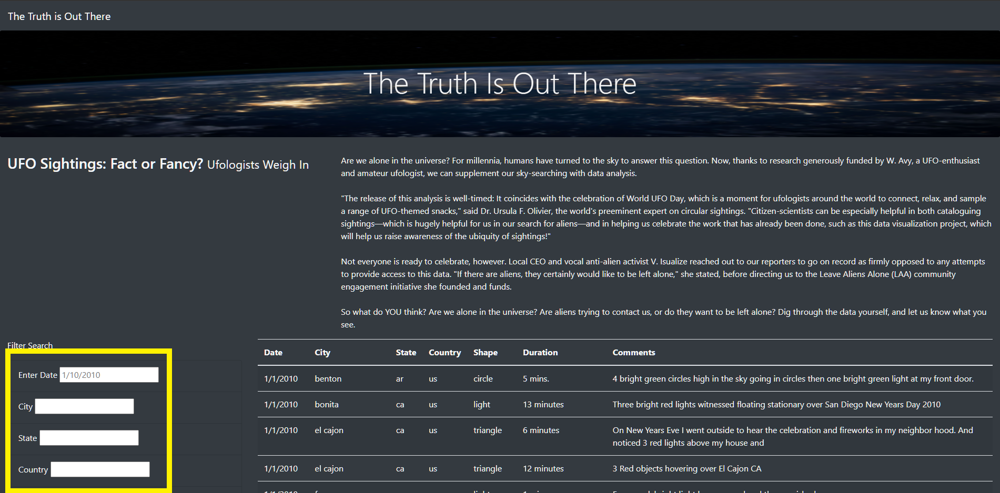

# UFOs

## Overview of the analysis
This project aims to build a responsive single page website that accepts user inputs to perform search/filter functionality on a table that is dynamically created using JavaScript (D3 library) to create a simple clean data visualization.
## Results
The deployed website is available at: https://esolomondev.github.io/UFOs/
### How To Search
The resulting link should take the browser to the home page (index.html) at the bottom of the page will be various inputs for search criteria that will filter the data displayed in the dynamic table.  Enter the criteria you wish to filter by and click anywhere outside the search box to preform the search.

## Summary
One of the drawbacks of this website is the case sensitivity, "CA" will not be seen as equivalent to "ca" as well as a lack of options for users to choose from for fairly ambiguous data (IE Shape). Two additional recommendations for further functionality are:
 - Input validation for case sensitivity from potential end users to maintain clarity.
 - Options for ambiguous inputs such as radio groups or checkboxes created from categories within the data
